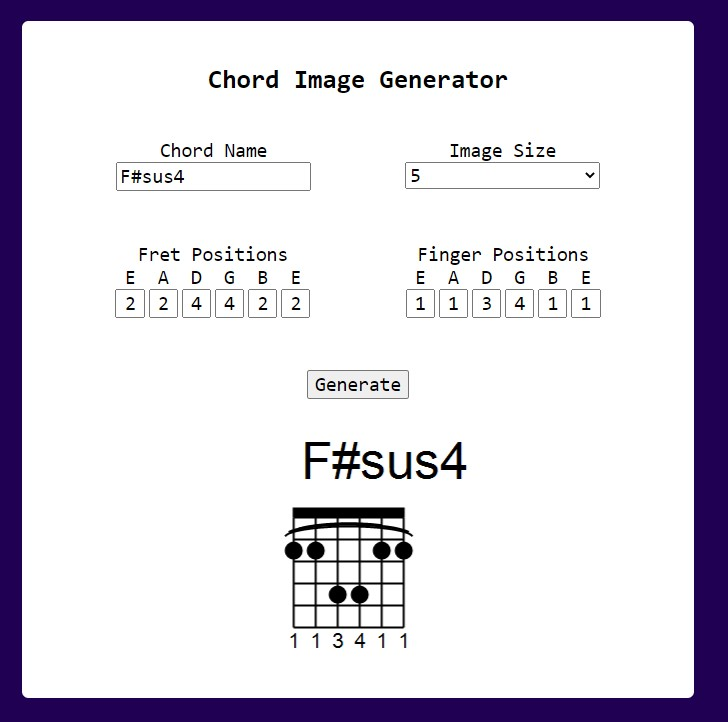
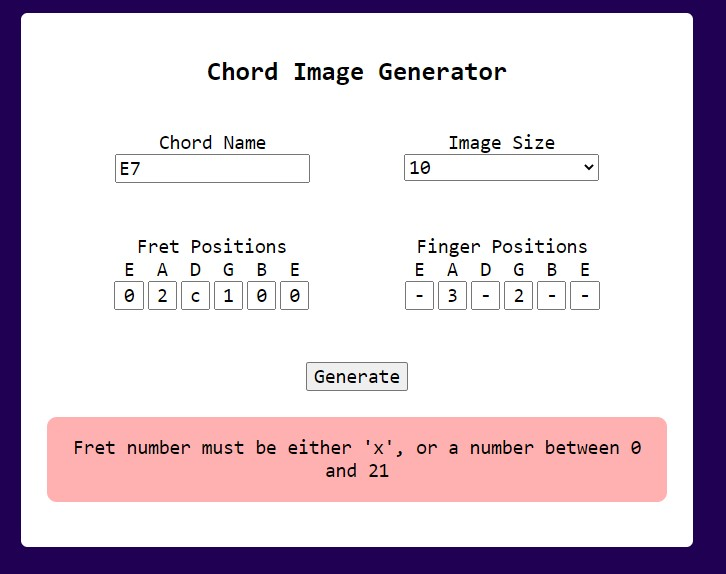
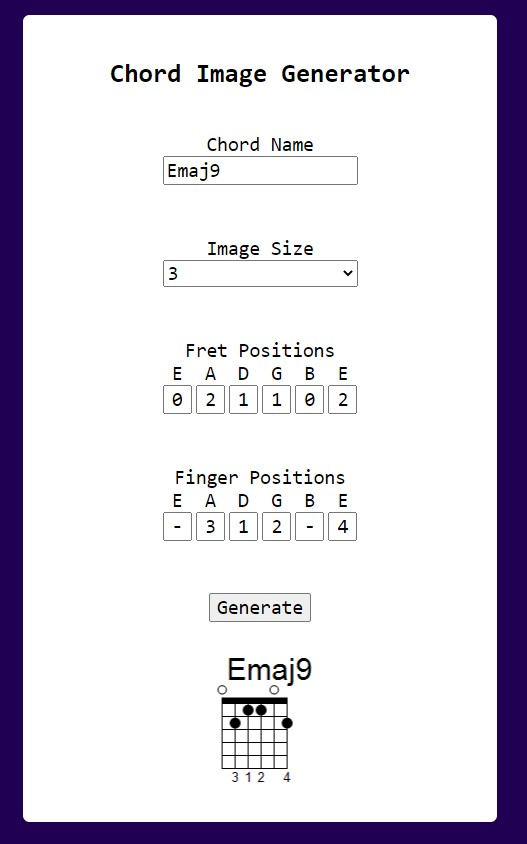

# Chord Image Generator

- Use it [here](https://joshuasearle.github.io/guitar-chord-image-generator/)
- Can generate guitar chord images, allowing users to specify:
  - Chord name
  - Size of the image
  - Which fret on which string to hold down
  - When finger on which string to use
  

- Has clean error handling
  

- Responsive design (hard to illustrate with images, but checkout the actual site and test it for yourself)

